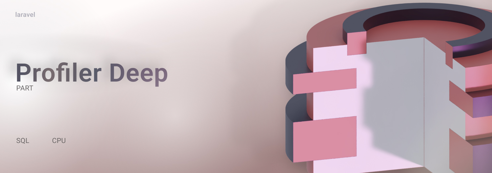

<p align="center">

</p>
 
## ProfilerDeep
Кароч изи пакет 
   

## Установка из composer

```  
composer require slavawins/laravel-profiler-deep
```

 Опубликовать js файлы, вью и миграции необходимые для работы пакета.
Вызывать команду:
```
php artisan vendor:publish --provider="ProfilerDeep\Providers\ProfilerDeepServiceProvider"
``` 

 В роутере routes/web.php удалить:
 добавить
 ```
    \ProfilerDeep\Library\ProfilerDeepRoute::routes();
 ```

Выполнить миграцию
 ```
    php artisan migrate 
 ``` 
